- [栈和队列](#栈和队列)
  - [栈的表示和实现](#栈的表示和实现)
    - [栈的概念及结构](#栈的概念及结构)
    - [栈的实现](#栈的实现)
  - [队列的表示和实现](#队列的表示和实现)
    - [队列的概念及结构](#队列的概念及结构)
    - [队列的实现](#队列的实现)

# 栈和队列

## 栈的表示和实现

### 栈的概念及结构

栈：一种特殊的线性表，其只允许在固定的一端进行插入和删除元素操作。进行数据插入和删除操作的一端称为栈顶，另一端称为栈底。栈中的数据元素遵守后进先出LIFO(Last In First Out)的原则。

压栈：栈的插入操作叫作进栈/压栈/入栈，入数据在栈顶。
出栈：栈的删除操作叫作出栈。出数据也在栈顶。



### 栈的实现

栈的实现一般可以使用数组或者链表实现，相对而言数组的实现更优。因为数组在尾插数据的代价较小。

```C{.line-numbers}
//静态栈的结构，实际中一般不实用
typedef int STDataType;
#define N 10
typedef struct Stack
{
    STDataType _a[N];
    int _top;//栈顶
}Stack；
//动态增长的栈
typedef int STDataType;
typedef struct Stack
{
    STDataType* _a;
    int _top;
    int _capacity;
}Stack;
//初始化栈
void StackInit(Stack* ps);
//入栈
void StackPush(Stack* ps,STDataType data);
//出栈
void StackPop(Stack* ps);
//获取栈顶元素
STDataType StackTop(Stack* ps);
//获取栈中有效元素个数
int StackSize(Stack* ps);
//检测栈是否为空，如果为空返回非零结果，如果不为空返回0
int StackEmpty(Stack* ps);
//销毁栈
void StackDestroy(Stack* ps);
```

## 队列的表示和实现

### 队列的概念及结构

队列：只允许在一端进行插入数据操作，在另一端进行删除数据操作的特殊线性表，队列具有先进先出FIFO(First In First Out)的特点。
进行插入操作(入队列)的一端称为队尾。
进行删除操作(出队列)的一端称为队头。



### 队列的实现

队列也可以用数组和链表的结构实现，使用链表的结构实现更优，因为如果使用数组的结构，出队列在数组头出数据，效率较低。



```C{.line-numbers}
//链式结构：表示队列
typedef struct QListNode
{
    struct QListNode* _pNext;
    QDataType _data;
}QNode;
//队列的结构
typedef struct Queue
{
    QNode* _front;
    QNode* _rear;
}Queue;
//初始化队列
void QueueInit(Queue* q);
//队尾入队列
void QueuePush(Queue* q,QDataType data);
//队头出队列
void QueuePop(Queue* q);
//获取队列头部元素
QDataType QueueFront(Queue* q);
//获取队列队尾元素
QDataType QueueBack(Queue* q);
//获取队列中有效元素个数
int QueueSize(Queue* q);
//检测队列是否为空，如果为空返回非零结果，如果非空返回0
int QueueEmpty(Queue* q);
//销毁队列
void QueueDestroy(Queue* q);
```
