- [树和二叉树](#树和二叉树)
  - [树概念及结构](#树概念及结构)
    - [树的概念](#树的概念)
    - [树的表示](#树的表示)
  - [二叉树概念及结构](#二叉树概念及结构)
    - [概念](#概念)
    - [特点](#特点)
    - [特殊二叉树](#特殊二叉树)
    - [二叉树的存储结构](#二叉树的存储结构)
    - [二叉树的性质](#二叉树的性质)
    - [顺序存储](#顺序存储)
    - [链式存储](#链式存储)
  - [二叉树链式结构实现](#二叉树链式结构实现)
    - [二叉树链式结构的遍历](#二叉树链式结构的遍历)
    - [前序/中序/后序的递归结构遍历](#前序中序后序的递归结构遍历)

# 树和二叉树

## 树概念及结构

### 树的概念

树是一种**非线性**的数据结构，它是由n(n>=0)个有限结点组成一个具有层次关系的集合。把它叫作树是因为它看起来像一棵倒挂的树，也就是说它是根朝上而叶朝下的。

* 有一个特殊的结点，称为根结点，根结点没有前驱结点
* 除根结点外，其余结点被分成M(M>0)个互不相交的集合T1、T2、……、Tm，其中每一个集合Ti(1<=i<=m)又是一棵结构与树类似的子树。每棵子树的根结点有且只有一个前驱，可以有0个或多个后继
* 因此，树是递归定义的


* 子树是不相交的
* 除了根结点外，每个结点有且仅有一个父结点
* 一棵N个结点的树有N-1条边


* 结点的度：一个结点含有的子树的个数称为该结点的度
  如上图：A结点的度为3
* 叶结点或终端结点：度为0的结点称为叶结点
  如上图：F、H、I、J、K、L为叶结点
* 非终端结点或分支结点：度不为0的结点
  如上图：A、B、C、D、E、G为分支结点
* 双亲结点或父结点：若一个结点含有子结点，则这个结点称为其子结点的父结点
  如上图：A是B、C、D的父结点
* 孩子结点或子结点：一个结点含有的子树的根结点称为该结点的子结点
  如上图：B是E的子结点
* 兄弟结点：具有相同父结点的结点互为兄弟结点
  如上图：E与F互为兄弟结点
* 树的度：一棵树中，最大的结点的度称为树的度
  如上图：树的度为3
* 结点的层次：从根开始定义，根为第一层，根的子结点为第二层，依次类推
* 树的高度或深度：树中结点的最大层次
  如上图：树的高度为4
* 结点的祖先：从根到该结点所经分支上的所有结点
  如上图：A是所有结点的祖先
* 子孙：以某结点为根的子树中任一结点都称为该结点的子孙
  如上图：所有结点都是A的子孙
* 森林：由m(m>0)棵互不相交的多棵树的集合称为森林(数据结构中的并查集本质就是一个森林)

### 树的表示

树结构相对线性表就比较复杂了，要存储表示起来就比较麻烦，实际中树有很多种表示方式，如：双亲表示法、孩子表示法、孩子兄弟表示法等。
孩子兄弟表示法：

```C{.line-numbers}
typedef int DataType;
struct Node
{
  struct Node* _firstChild;//第一个孩子结点
  struct Node* _pNextBrother;//指向其下一个兄弟结点
  DataType _data;//结点中的数据域
};
```


## 二叉树概念及结构

### 概念

一棵二叉树是结点的一个有限集合，该集合或者为空，或者是由一个根结点加上两棵别称为左子树和右子树的二叉树组成。

### 特点

1. 每个结点最多有两棵子树，所以二叉树中不存在度大于2的结点
2. 左子树与右子树有次序之分，不能任意颠倒
3. 即使某结点只有一棵子树，也要区分它是左子树还是右子树

### 特殊二叉树

1. 斜树
   * 左斜树：所有结点都只有左子树的二叉树
   * 右斜树：所有结点都只有右子树的二叉树
2. 满二叉树：所有分支结点都存在左子树与右子树，并且所有叶子都在同一层上的二叉树
3. 完全二叉树：对于深度为k、有n个结点的二叉树，当且仅当其每一个结点都与深度为k的满二叉树中编号从1至n的结点一一对应时，称之为完全二叉树

### 二叉树的存储结构

二叉树一般可以使用两种结构存储，一种是顺序结构，一种是链式结构。

### 二叉树的性质

性质1：在二叉树的第i层至多有$2^{i-1}(i \geq 1)$个结点。
性质2：深度为k的二叉树至多有$2^{k}-1(k \geq 1)$个结点。
性质3：对任何一棵二叉树T，如果其终端结点数为$n_0$，度为2的结点数为$n_2$，则$n_0=n_2+1$。
性质4：具有n个结点的完全二叉树的深度为$\lfloor log_{2}n+1 \rfloor$。

### 顺序存储

顺序结构存储就是使用数组来存储，一般使用数组只适合表示完全二叉树，因为不是完全二叉树会有空间浪费，而现实使用中只有堆才会使用数组来存储。二叉树顺序存储在物理上是一个数组，在逻辑上是一棵二叉树。

### 链式存储

二叉树的链式存储结构是指，用链表来表示一棵二叉树，即用链来指示元素的逻辑关系。通常的方法是链表中每个结点由三个域组成，数据域与左右指针域，左右指针分别来给出该结点左孩子和右孩子所在的链结点的存储地址。链式结构又分为二叉链和三叉链。

```C{.line-numbers}
//二叉链
struct BinaryTreeNode
{
  struct BinTreeNode* pLeft;//指向当前结点左孩子
  struct BinTreeNode* pRight;//指向当前结点右孩子
  BTDataType _data;//当前结点值域
};
//三叉链
struct BinaryTreeNode
{
  struct BinTreeNode* pParent;//指向当前结点的双亲
  struct BinTreeNode* pLeft;//指向当前结点的左孩子
  struct BinTreeNode* pRight;//指向当前结点的右孩子
  BTDataType _data;//当前结点值域
};
```

## 二叉树链式结构实现

### 二叉树链式结构的遍历

所谓遍历(Traversal)是指沿着某条搜索路线，依次对树中每个结点均做一次且仅做一次访问。访问结点所做的操作依赖于具体的应用问题。遍历是二叉树上最重要的运算之一，是二叉树上进行其它运算之基础。

### 前序/中序/后序的递归结构遍历

从二叉树的递归定义可知，一棵非空的二叉树由根结点及左、右子树三个基本部分组成。因此，在任一给定结点上，可以按某种次序执行三个操作。

* 放问结点本身(N)
* 遍历该结点的左子树(L)
* 遍历该结点的右子树(R)

以上三种操作有六种执行次序：
NLR、LNR、LRN、NRL、RNL、RLN
前三种次序与后三种次序对称，故只讨论先左后右的前三种次序。

常见的三种递归遍历方法：
1. NLR：前序遍历(Preorder Traversal亦称先序遍历)：访问根结点的操作发生在遍历其左右子树之前。
2. LNR：中序遍历(Inorder Traversal)：访问根结点的操作发生在遍历其左右子树之中。
3. LRN：后序遍历(Postorder Traversal)：访问根结点的操作发生在遍历其左右子树之后。

由于被访问的结点必是某子树的根，所以N(Node)、L(Left subtree)、R(Right subtree)又可解释为根、根的左子树和根的右子树。NLR、LNR和LRN分别又称为先根遍历、中根遍历和后根遍历。



层序遍历：除了先序遍历、中序遍历、后序遍历外，还可以对二叉树进行层序遍历。设二叉树的根结点所在层数为1，层序遍历就是从所在二叉树的根结点出发，首先访问第一层的树根结点，然后从左到右访问第二层上的结点，接着是第三层的结点，以此类推，自上而下，自左至右逐层访问树的结点的过程就是层序遍历。


   